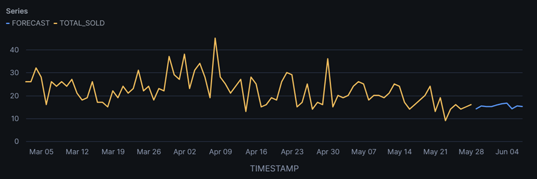

# Snowflake ML Forecasting vs Prophet

## Overview

This project explores two different approaches to time-series forecasting:

* **Snowflake ML Forecast**, a fully managed forecasting solution integrated into the Snowflake ecosystem.
* **Prophet**, an open-source forecasting library developed by Meta.

Using the same sales dataset, the objective is to compare:

* Ease of implementation
* Interpretability
* Forecasting workflow
* Operational complexity

The project was initially inspired by the Snowflake Quickstart:

**Getting Started with Snowflake ML Functions: Anomaly Detection & Forecasting**

---

## Dataset

The dataset contains historical sales records for a food item sold in Vancouver.

Main variables:

| Column     | Description          |
| ---------- | -------------------- |
| timestamp  | Date of sale         |
| total_sold | Number of units sold |

The forecasting objective is to predict future sales demand based on historical observations.

---

## Project Structure

```text
.
├── data/
│   └── lobster_sales.csv
│
├── images/
│   └── snowflake_forecast.png
│
├── notebooks/
│   └── prophet_comparison.ipynb
│
├── sql/
│   ├── 01_data_preparation.sql
│   ├── 02_snowflake_forecast.sql
│   ├── 03_feature_importance.sql
│   └── 04_anomaly_detection.sql
│
└── README.md
```

---

## Snowflake Workflow

Snowflake Forecast was trained using the native ML Functions available in Snowsight.

The forecasting workflow included:

* Data ingestion from S3
* Forecast model training
* Feature importance analysis
* Anomaly detection
* Scheduled retraining through Tasks
* Automated reporting through Stored Procedures

### Snowflake Forecast Result



### Observations

The Snowflake forecast converges towards a relatively stable demand level.

The model appears to smooth short-term fluctuations and generate conservative forecasts despite the volatility observed in historical sales.

---

## Prophet Workflow

The same dataset was exported and evaluated using Prophet.

Workflow:

1. Data preparation
2. Train / Test split
3. Model training
4. Forecast generation
5. Performance evaluation
6. Trend and seasonality analysis

### Why Prophet?

Prophet offers greater transparency than many AutoML forecasting systems.

The model explicitly decomposes a time series into:

* Trend
* Seasonality
* Holiday effects
* Residual noise

This makes the forecasting process easier to understand and interpret.

---

## Snowflake vs Prophet

| Criteria                  | Snowflake Forecast | Prophet      |
| ------------------------- | ------------------ | ------------ |
| Setup Complexity          | Very Low           | Low          |
| Infrastructure Management | Fully Managed      | Self Managed |
| SQL Native                | Yes                | No           |
| Python Required           | No                 | Yes          |
| Transparency              | Low                | High         |
| Explainability            | Medium             | High         |
| Model Customization       | Limited            | High         |
| Enterprise Integration    | Excellent          | Moderate     |

---

## Key Learnings

Through this project, I explored:

* Native ML capabilities within Snowflake
* Time-series forecasting workflows
* Feature importance analysis
* Anomaly detection on sales data
* Forecast uncertainty intervals
* Differences between managed AutoML systems and open-source forecasting frameworks

One of the main observations is that managed platforms such as Snowflake significantly reduce operational complexity but provide less visibility into the underlying forecasting methodology.

Conversely, Prophet offers greater interpretability and control at the cost of increased implementation effort.

---

## Technologies

* Snowflake
* Snowsight
* SQL
* Snowflake ML Functions
* Prophet
* Python
* Pandas
* Matplotlib

---

## Future Improvements

Potential next steps:

* Add holiday calendars to Prophet
* Compare forecast accuracy metrics
* Benchmark against additional forecasting models
* Evaluate forecasting performance on multiple product series
* Build a complete automated forecasting pipeline